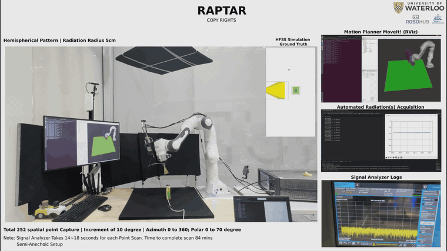

<div align="center">

# RAPTAR: Radar Radiation Pattern Acquisition through Automated Collaborative Robotics

**Motion planning code for collision-aware hemispherical scanning with a Franka Emika Panda cobot**

[Maaz Qureshi](https://github.com/Maaz-qureshi98), Mohammad Omid Bagheri, Abdelrahman Elbadrawy, William Melek, George Shaker
<br>
University of Waterloo

[](https://arxiv.org/abs/2507.16988)
[](https://youtu.be/T0bPr-P4mGE)
[](http://wiki.ros.org/noetic)
[](https://moveit.ros.org/)
[](LICENSE)

### **[▶ Watch the full demo video on YouTube](https://youtu.be/T0bPr-P4mGE)**

<a href="https://youtu.be/T0bPr-P4mGE">
  
</a>

<sub>Click the GIF to watch the full video. It plays at 2.5× speed.</sub>

</div>

---

## Overview

RAPTAR is a portable, autonomous system that measures the 3D radiation pattern of integrated radar modules **without an anechoic chamber**. A 7-DoF Franka Emika Panda carries the receiver probe across a hemisphere centred on the device under test. MoveIt plans collision-free motions around the table, the device under test and the antenna mounted on the end effector.

This repository contains the ROS/MoveIt motion-planning package used in the paper:

- **Hemispherical scan.** Poses are spaced every 10° in azimuth (φ: −180° to 170°) and polar angle (θ: 0° to −70°). At each pose the probe points at the centre of the sphere.
- **Collision-aware planning.** The table and device under test are added to the planning scene. The antenna mount is modelled as an L-shaped collision object attached to the flange.
- **Minimal joint motion.** For each pose, RRTConnect plans two goals that differ by a 180° tool roll. The arm runs whichever one needs less joint travel.
- **Measurement dwell.** The arm holds at each pose so the signal analyzer can record received power.

Results reported in the paper: calibration RMS error below 0.9 mm, angular resolution up to 2.5°, and a mean absolute error below 2 dB against full-wave EM simulation for a 60 GHz radar module.

## Repository structure

```
RAPTAR-Motion-Planning/
├── src/panda_moveit_demo/          # catkin package
│   ├── scripts/
│   │   ├── add_table.py            # adds the table and DUT to the planning scene
│   │   ├── attach_rectangle.py     # attaches the L-shaped antenna mount to the flange
│   │   └── panda_motion_plan.py    # hemispherical scan planner and executor
│   ├── CMakeLists.txt
│   └── package.xml
├── archive/                        # earlier script versions (simulation and hardware test)
├── docs/
│   ├── robohub_setup.md            # lab notes for the UWaterloo RoboHub Panda and Docker setup
│   └── tf_frames.gv                # TF tree of the Panda (from view_frames)
├── media/raptar_demo.gif
├── CITATION.cff
└── LICENSE
```

## Requirements

- Ubuntu 20.04 with [ROS Noetic](http://wiki.ros.org/noetic/Installation/Ubuntu)
- [MoveIt 1](https://moveit.github.io/moveit_tutorials/) and `panda_moveit_config`
- `eigenpy` and `numpy`
- A Franka Emika Panda with FCI enabled (only for hardware runs)

## Installation

```bash
mkdir -p ~/raptar_ws/src && cd ~/raptar_ws/src
git clone https://github.com/Maaz-qureshi98/RAPTAR-Motion-Planning.git
cd ~/raptar_ws
rosdep install --from-paths src --ignore-src -r -y
catkin build   # or: catkin_make
source devel/setup.bash
```

## Usage

**1. Start MoveIt.** For simulation:

```bash
roslaunch panda_moveit_config demo.launch rviz_tutorial:=true
```

On the real robot, start the Franka control stack and point MoveIt at it instead. See [docs/robohub_setup.md](docs/robohub_setup.md).

**2. Run the scripts in order** in a second terminal, after sourcing the workspace:

```bash
rosrun panda_moveit_demo add_table.py          # table and device under test
rosrun panda_moveit_demo attach_rectangle.py   # antenna mount on the flange
rosrun panda_moveit_demo panda_motion_plan.py  # hemispherical scan
```

### Main parameters (`panda_motion_plan.py`)

| Parameter | Default | Description |
|---|---|---|
| `radius` | 0.17 m | Scan hemisphere radius |
| `phi_values` | −180° to 170°, 10° step | Azimuth sweep |
| `theta_values` | 0° to −70°, 10° step | Polar sweep |
| Planner | `RRTConnect` | OMPL planner |
| Goal tolerance | 5 mm / 0.02 rad | Position / orientation |
| Velocity and acceleration scaling | 0.05 | Slow, safe motion near the device |
| Dwell per pose | 20 s | Time for the signal analyzer to capture |

## Citation

If you use this code, please cite:

```bibtex
@article{qureshi2025raptar,
  title   = {{RAPTAR}: Radar Radiation Pattern Acquisition through Automated Collaborative Robotics},
  author  = {Qureshi, Maaz and Bagheri, Mohammad Omid and Elbadrawy, Abdelrahman and Melek, William and Shaker, George},
  journal = {arXiv preprint arXiv:2507.16988},
  year    = {2025},
  doi     = {10.48550/arXiv.2507.16988}
}
```

## Acknowledgements

This work was carried out at the University of Waterloo using the [RoboHub](https://uwaterloo.ca/robohub/) Franka Emika Panda.

## License

Released under the [MIT License](LICENSE).
